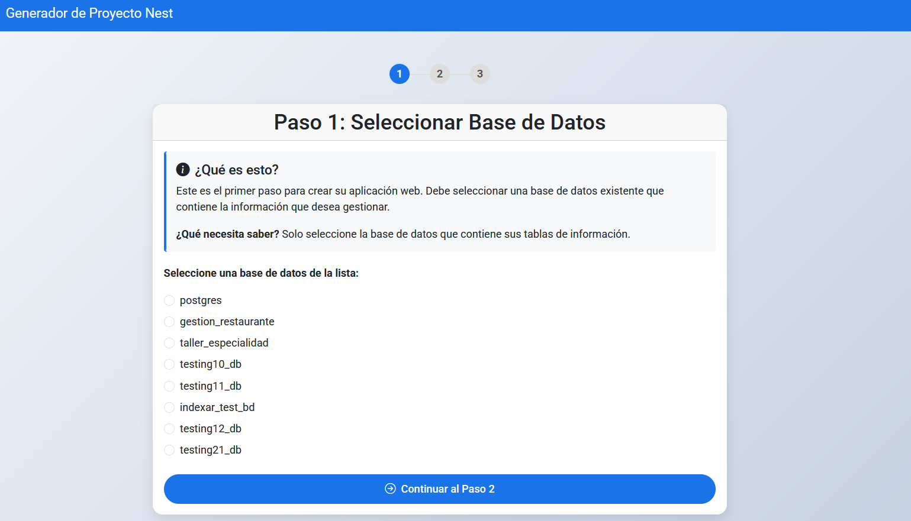
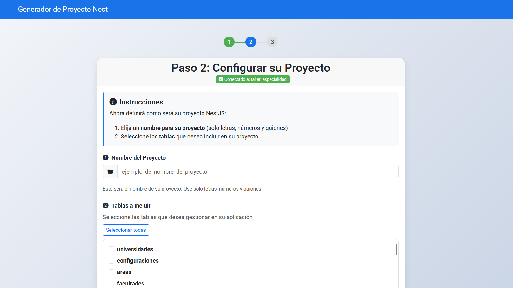
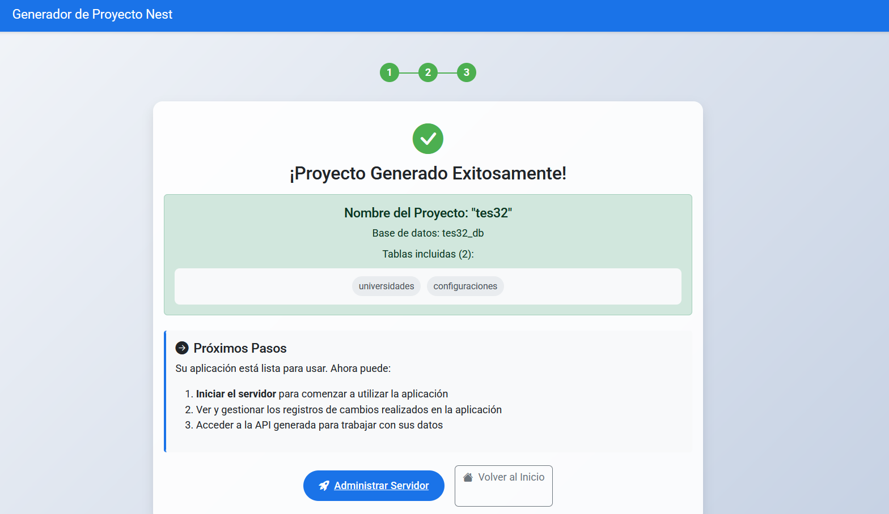
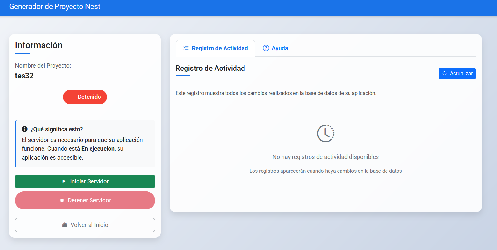
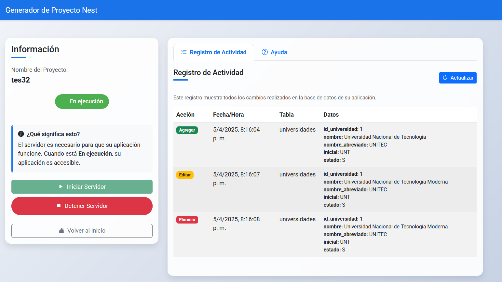

# Generador de Proyectos NestJS

Este proyecto es una herramienta que permite generar automáticamente proyectos NestJS a partir de una base de datos PostgreSQL existente. Incluye funcionalidades de auditoría encriptada y gestión de servidores generados.

## Características

- Generación automática de proyectos NestJS
- Soporte para múltiples bases de datos PostgreSQL
- Generación automática de módulos, controladores y servicios
- Sistema de auditoría encriptado para todas las operaciones CRUD
- Interfaz web
- Gestión de servidores (iniciar/detener)
- Visualización de registros de auditoría

## Requisitos Previos

- Node.js (versión 14 o superior)
- PostgreSQL (versión 12 o superior)
- NestJS CLI instalado globalmente (`npm install -g @nestjs/cli`)

## Dependencias

El proyecto utiliza las siguientes dependencias principales:

- express (v4.21.2) - Framework web para Node.js
- jsonwebtoken (v9.0.2) - Implementación de JSON Web Tokens
- pg (v8.13.3) - Cliente PostgreSQL para Node.js
- mysql (v2.18.1) - Cliente MySQL para Node.js
- tree-kill (v1.2.2) - Utilidad para terminar procesos

## Instalación

1. Clonar el repositorio:
```bash
git clone https://github.com/JasonS71/generador_proyecto_nest.git
cd generador_proyecto_nest
```

2. Instalar dependencias:
```bash
npm install
```

3. Configurar la base de datos:
   - Asegúrate de tener PostgreSQL instalado y corriendo
   - Las credenciales por defecto son:
     - Usuario: postgres
     - Contraseña: 12345
     - Puerto: 5432
   - Puedes modificar estas credenciales en el archivo `app.js`

## Uso

1. Iniciar el servidor:
```bash
node app.js
```

2. Abrir el navegador y acceder a:
```
http://localhost:3001
```

3. **Paso 1: Seleccionar Base de Datos**
   - Seleccione la base de datos de origen que contiene las tablas que desea incluir en su proyecto NestJS
   
   
   <!-- Incluir aquí la imagen de la interfaz de selección de Base de Datos -->

4. **Paso 2: Configurar el Proyecto**
   - Ingrese un nombre para su proyecto
   - Seleccione las tablas que desea incluir en su aplicación
   - Puede usar el botón "Seleccionar todas" para mayor comodidad
   
   
   <!-- Incluir aquí la imagen de la interfaz de selección de tablas -->

5. **Paso 3: Proyecto Generado**
   - Una vez completado el proceso, verá una pantalla de confirmación con los detalles del proyecto
   - Se mostrará el nombre del proyecto, la base de datos creada y las tablas incluidas
   
   
   <!-- Incluir aquí la imagen de la pantalla de éxito -->

6. **Administrar Servidor**
   - Desde la pantalla de administración puede iniciar o detener el servidor
   - El panel izquierdo muestra información del proyecto y controles del servidor
   - El panel derecho muestra el registro de actividad
   
   
   <!-- Incluir aquí la imagen de la pantalla de gestión del servidor con auditoría vacía -->

7. **Visualización de Auditoría**
   - Una vez que realice operaciones en su aplicación, podrá ver el registro de actividad
   - Cada acción (Agregar, Editar, Eliminar) se registra con fecha, hora y detalles
   
   
   <!-- Incluir aquí la imagen de la pantalla de gestión con datos de auditoría -->

## Estructura del Proyecto Generado

Para cada tabla seleccionada, se generan los siguientes archivos:

4. Una vez generado el proyecto:
   - Puedes iniciar/detener el servidor desde la interfaz
   - Ver los registros de auditoría de las operaciones
   - Acceder a la documentación de la API generada

## Auditoría

El sistema incluye un sistema de auditoría encriptado que registra:
- Operaciones de creación (POST)
- Operaciones de actualización (PUT)
- Operaciones de eliminación (DELETE)

Los registros de auditoría incluyen:
- Tipo de operación
- Fecha y hora
- Tabla afectada
- Datos modificados

## Seguridad

- Todas las operaciones de auditoría están encriptadas usando AES-256-CBC
- Las credenciales de la base de datos se manejan de forma segura
- Los datos sensibles se encriptan antes de ser almacenados

## Tecnologías Utilizadas

- Node.js
- Express.js
- PostgreSQL
- NestJS
- Bootstrap 5
- Crypto (Node.js)
